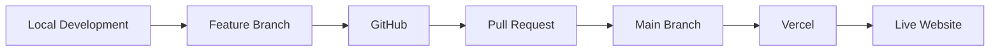

<div align="center">

# ByteSpace New

**A modern, responsive learning platform built for the ByteSpace Frontend Assessment.**

Pixel-focused implementation of the Figma design with reusable components, clean structure and a smooth user experience.

<br />

[](https://your-project.vercel.app)
[](https://github.com/Ripon-Mardy/bytespace-new)
[](https://www.figma.com/design/26TBgRjmpuxudcErJsHUfy/ByteSpace-New-Check-website)

<br />


</div>

---

## 📑 Table of Contents

- [Preview](#-preview)
- [Features](#-features)
- [Tech Stack](#-tech-stack)
- [Project Structure](#-project-structure)
- [Getting Started](#-getting-started)
- [Available Scripts](#-available-scripts)
- [Responsive Design](#-responsive-design)
- [Reusable Components](#-reusable-components)
- [Git Workflow](#-git-workflow)
- [Deployment](#-deployment)
- [Assessment Requirements](#-assessment-requirements)
- [Author](#-author)

---

## 🖼️ Preview

<!-- Add a screenshot of your landing page here:
     1. Put the image in /public/screenshots/home.png
     2. Uncomment the line below -->

<!--  -->

> Live site: **[your-project.vercel.app](https://your-project.vercel.app)**

---

## ✨ Features

### Landing Page

- Responsive navigation with a mobile menu
- Hero section
- Course and creator sections
- Features section
- Testimonials section
- Call-to-action sections
- Responsive footer
- Smooth animations and interactions
- Mobile-friendly layout built from reusable UI components

### 🎁 Bonus Pages

| Page               | Description                                 |
| ------------------ | ------------------------------------------- |
| **Login**          | Sign-in page with a clean, responsive form  |
| **Signup**         | Account creation page                       |
| **Course Details** | Course info, enroll card and tabbed content |
| **404**            | Custom "page not found" screen              |

---

## 🛠️ Tech Stack

| Technology                                      | Purpose                           |
| ----------------------------------------------- | --------------------------------- |
| [Next.js](https://nextjs.org/)                  | App Router, routing and rendering |
| [React](https://react.dev/)                     | UI library                        |
| [TypeScript](https://www.typescriptlang.org/)   | Type safety                       |
| [Tailwind CSS](https://tailwindcss.com/)        | Styling                           |
| [Framer Motion](https://www.framer.com/motion/) | Animations                        |
| [Lucide Icons](https://lucide.dev/)             | Icon set                          |
| [Vercel](https://vercel.com/)                   | Hosting and deployment            |

---

## 📁 Project Structure

```bash
bytespace-new/
├── public/
│   ├── images/
│   ├── icons/
│   └── ...
│
├── src/
│   ├── app/
│   │   ├── courses/
│   │   │   └── [slug]/
│   │   │       └── page.tsx     # Course details page
│   │   ├── login/
│   │   │   └── page.tsx
│   │   ├── signup/
│   │   │   └── page.tsx
│   │   ├── globals.css
│   │   ├── layout.tsx
│   │   ├── not-found.tsx        # Custom 404 page
│   │   └── page.tsx             # Landing page
│   │
│   ├── components/
│   │   ├── course-details/      # EnrollCard, CourseTabs
│   │   ├── home/                # Landing page sections
│   │   ├── layout/              # Header, Footer, MobileMenu
│   │   └── ui/                  # Button, Container, SectionHeading...
│   │
│   ├── data/                    # Static data (courses, etc.)
│   └── lib/                     # Helpers and utilities
│
├── .gitignore
├── next.config.ts
├── package.json
├── postcss.config.mjs
├── tsconfig.json
└── README.md
```

---

## 🚀 Getting Started

Follow these steps to run the project locally.

**Prerequisites:** [Node.js](https://nodejs.org/) 20 or newer and npm.

```bash
# 1. Clone the repository
git clone https://github.com/Ripon-Mardy/bytespace-new.git

# 2. Go to the project directory
cd bytespace-new

# 3. Install dependencies
npm install

# 4. Start the development server
npm run dev
```

Open [http://localhost:3000](http://localhost:3000) in your browser.

---

## 📜 Available Scripts

| Command         | Description                           |
| --------------- | ------------------------------------- |
| `npm run dev`   | Starts the development server         |
| `npm run build` | Creates an optimized production build |
| `npm run start` | Starts the production server          |
| `npm run lint`  | Checks the project for linting issues |

---

## 📱 Responsive Design

Designed and tested across common screen sizes:

| Device     | Status       |
| ---------- | ------------ |
| 📱 Mobile  | ✅ Supported |
| 📱 Tablet  | ✅ Supported |
| 💻 Laptop  | ✅ Supported |
| 🖥️ Desktop | ✅ Supported |

Navigation, sections, cards, typography, spacing and layouts all adapt to the viewport.

---

## 🧩 Reusable Components

The project follows a reusable, component-based architecture:

| Layout       | UI               | Feature            |
| ------------ | ---------------- | ------------------ |
| `Header`     | `Button`         | `CourseCard`       |
| `MobileMenu` | `Container`      | `CreatorCard`      |
| `Footer`     | `SectionHeading` | `TestimonialsCard` |
|              |                  | `CourseTabs`       |
|              |                  | `EnrollCard`       |

This keeps the code organized, maintainable and easy to extend.

---

## 🌿 Git Workflow

The project follows a feature-branch workflow.

| Branch                      | Purpose               |
| --------------------------- | --------------------- |
| `main`                      | Production-ready code |
| `feature/bytespace-landing` | Main implementation   |

All work was developed on the feature branch and merged into `main` through a Pull Request.

---

## 🌐 Deployment

The project is deployed on **Vercel**.



---

## 📋 Assessment Requirements

This project was created for the **ByteSpace New Frontend Assessment**.

**Required**

- [x] Complete the full landing page based on the Figma design
- [x] Push the code to a public GitHub repository
- [x] Use a separate Git branch
- [x] Create a Pull Request
- [x] Deploy the website to Vercel
- [x] Submit the live website URL and GitHub repository

**Bonus**

- [x] Login page
- [x] Signup page

---

## 👨‍💻 Author

**Ripon Mardy**
Frontend Developer

[](https://github.com/Ripon-Mardy)

---

<div align="center">

Built with care for the ByteSpace Frontend Assessment.

</div>
